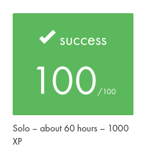

# Academic Project Context

## Project Record

| Field | Value |
| --- | --- |
| Project | `so_long` |
| Curriculum | 42 Common Core |
| Subject version | 5.0 |
| Final evaluation | **100/100** |
| Project type | Individual |
| Estimated curriculum workload | About 60 hours |
| Curriculum XP | 1000 XP |

## Evaluation

The original 42 project received a final evaluation of **100/100**.

The image is a cropped record of the original 42 Intra evaluation result.
It intentionally excludes evaluator identities, peer comments, internal
repository information, private URLs, navigation elements, and unrelated
platform statistics.

## Repository History

This repository began as my implementation of the 42 Common Core `so_long`
project, developed against **subject version 5.0**.

The current `main` branch is a maintained portfolio edition. It includes
post-evaluation work such as dependency cleanup, automated regression testing,
CI, resource-lifetime hardening, maintainability improvements, and
documentation.

The annotated tag `portfolio-baseline-2026-09` preserves the repository state
immediately before the professional portfolio modernization.

That tag should not be interpreted as necessarily identifying the exact
academic evaluation commit. Some maintenance work had already taken place
before the portfolio modernization began.

## Subject

The original 42 subject PDF is not redistributed in this repository.

The academic specification used for the project is recorded as:

- **Project:** `so_long`
- **Subject version:** 5.0
- **Curriculum:** 42 Common Core

This preserves traceability to the specification without republishing the
original curriculum document.
